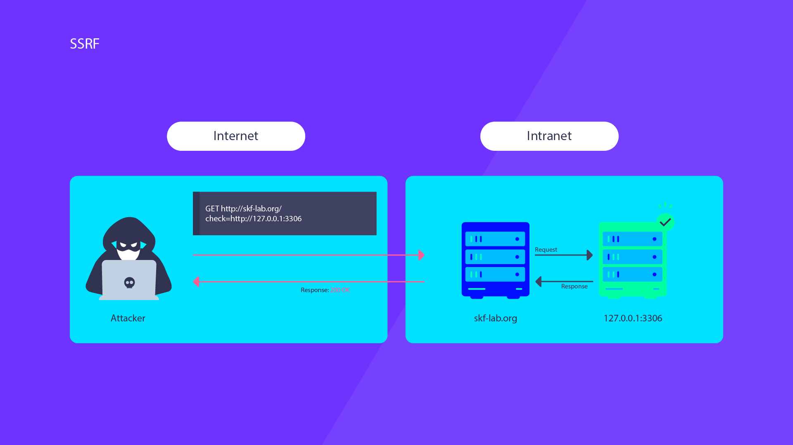

# Welcome to the SSRF Labs Chapter

Server-side Request Forgery (SSRF) is a web security vulnerability that allows an attacker to induce the server-side application to make HTTP requests to an arbitrary domain of the attacker's choosing.
SSRF vulnerabilities can be difficult to exploit, but when they are, they can potentially lead to serious breaches, including sensitive data exposure, denial of service, or remote code execution. Therefore, they are a significant security concern that needs to be addressed in web applications. Mitigation strategies often involve whitelisting or validating user inputs, controlling what network requests your server-side application can make, and employing a firewall to block outgoing network connections from your server to the internal network.

## Starting the lab

<Link to digital ocean> --> blabla1337/owasp-skf-lab:ssrf

### Objective:

Use SSRF to find if we can reach internal services running.

### Download the lab guide:

assets/11.1.1-SSRF-lab-guide.pdf

## Knowledge Check

**On what port is the internal service exposed?**
[ANSWER: 3306] 

**What does SSRF stand for?**
   - a) Secure Socket Request Failure
 **- b) Server-side Request Forgery**
   - c) Secure Server Request Format
   - d) Server Socket Request Form

**Which of the following best describes an SSRF attack?**
 **- a) An attacker forces a server to perform requests to an arbitrary domain of the attacker's choosing**
   - b) An attacker forces a client-side browser to make requests to an arbitrary domain
   - c) An attacker intercepts and alters the communication between a client and a server
   - d) An attacker uses a phishing attempt to trick a user into revealing sensitive information

**Why is an SSRF attack dangerous?**
   - a) It allows an attacker to send spam emails
 **- b) It allows an attacker to access and interact with internal systems typically shielded by a firewall**
   - c) It allows an attacker to change the user interface of a site
   - d) It allows an attacker to create a clone of a site

**Which of the following can be a potential outcome of a successful SSRF attack?**
   - a) Changing the color scheme of a site
   - b) Manipulating user-uploaded content
 **- c) Accessing sensitive data stored on the internal network**
   - d) Adding new features to the site

**What is one of the mitigation strategies for preventing SSRF attacks?**
   - a) User interface testing
 **- b) Whitelisting or validating user inputs**
   - c) Disabling all user inputs
   - d) Regularly changing the domain name

