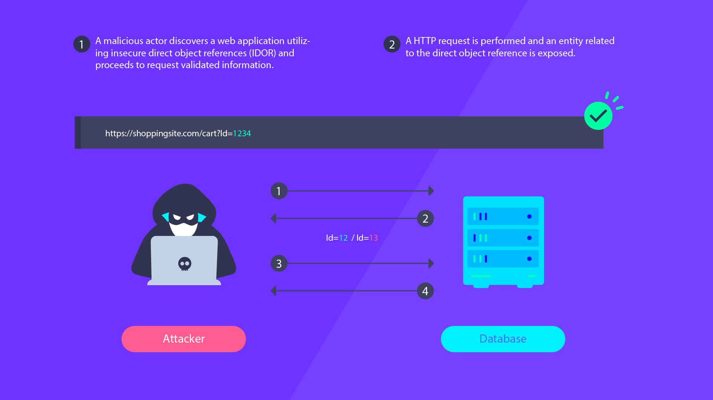
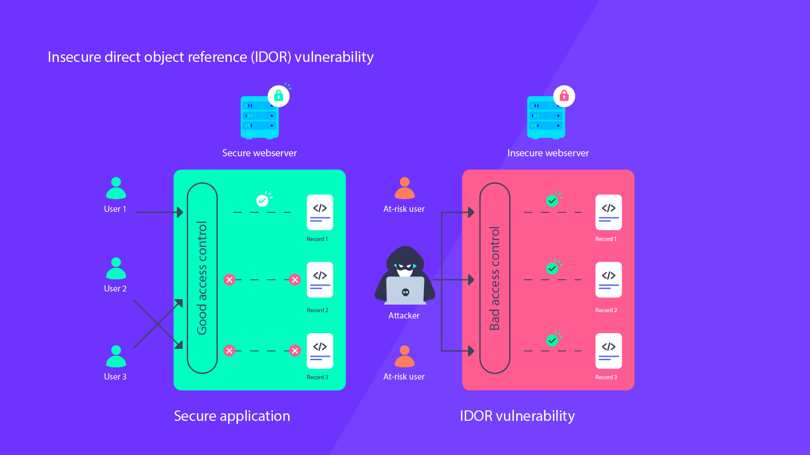

# Introduction to Insecure Direct Object References (IDOR)

Insecure Direct Object References (IDOR) is a common security vulnerability that occurs when an application exposes direct access to internal objects, such as files, database records, or other system resources, without proper access control. This can lead to unauthorized users being able to access, modify, or delete sensitive data, potentially causing severe consequences for the system and its users.

IDOR vulnerabilities typically arise when developers implement insufficient or improper access controls on resources that are referenced by URL parameters, form fields, or other user-controlled inputs. Attackers can exploit these vulnerabilities by manipulating these inputs to gain unauthorized access to resources that they should not be able to access.

## Starting the lab

Link to digital ocean --> blabla1337/owasp-skf-lab:idor

### Objective:

Find the secret PDF and take note of the secret pdf ID!

### Download the lab guide:

assets/2.1.1-IDOR-lab-guide.pdf

## Knowledge Check

**What is the ID of the secret PDF**
[ANSWER: 46] 

**What does IDOR stand for?**
    - a) Insecure Data Object Reference
    - b) Internal Direct Object Reference
    - c) **Insecure Direct Object References**
    - d) Indirect Data Object Reference

**Which of the following is a primary cause of IDOR vulnerabilities?**
    - a) Insufficient encryption
    - b) Weak password policies
    - c) **Inadequate access controls**
    - d) Misconfigured servers

**What is an example of a user-controlled input that can lead to IDOR vulnerabilities?**
    - a) **URL parameters**
    - b) Server-side session variables
    - c) Hard-coded application settings
    - d) Application log files

**Why is it recommended to use tokens or UUIDs as references instead of id's (1,2,3,etc)?**
    - a) They are easier to guess
    - b) They improve application performance
    - c) They are easier to manipulate
    - d) **They are harder to guess or manipulate**

**What is the principle of least privilege?**
    - a) All users should have equal access to resources
    - b) **Users should only have access to the resources they need**
    - c) Users should be given the highest level of access by default
    - d) All users should have administrative access
