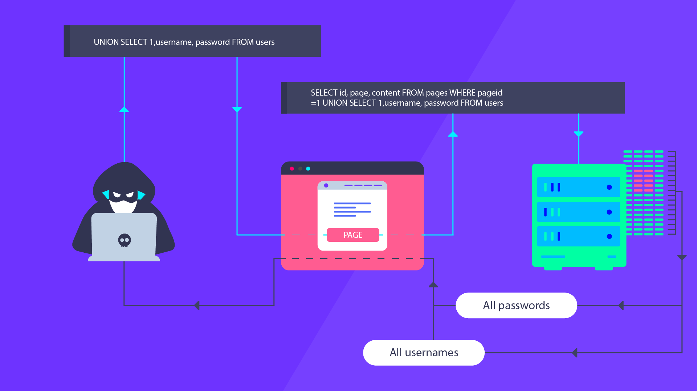

# Introduction to SQL Injection

SQL (Structured Query Language) Injection is a common web application vulnerability that occurs when malicious SQL code is inserted into an application's database query. This injection attack can allow an attacker to manipulate the application's database, gain unauthorized access to sensitive information, modify data, or even execute arbitrary commands on the underlying server.

## How SQL Injection Can Be a Security Problem

SQL Injection poses a significant security risk to web applications as it takes advantage of poor input validation and inadequate handling of user-supplied data. Here's how it can be a security problem:

1. **Unauthorized Access**: By injecting SQL code, an attacker can bypass authentication mechanisms and gain unauthorized access to restricted data or functionality.

2. **Data Disclosure**: Attackers can extract sensitive information from the database, such as usernames, passwords, credit card details, or other personally identifiable information.

3. **Data Manipulation**: SQL Injection allows attackers to modify, delete, or insert data into the database, altering the application's behavior or compromising data integrity.

4. **Remote Code Execution**: In severe cases, attackers can execute arbitrary commands on the underlying server, leading to a complete compromise of the system.

## Starting the lab

<Link to digital ocean> --> blabla1337/owasp-skf-lab:sqli

### Objective:

Perform a SQL injection and read from the database the admin's password

### Download the lab guide:

assets/4.1.1-SQLI-lab-guide.pdf

## Knowledge Check

**What is the admin's password?**
[ANSWER: Password1!] 

**What is SQL Injection?**
 **- a) A web application vulnerability that allows attackers to manipulate databases**
   - b) A cryptographic algorithm used to secure database transactions
   - c) A secure coding practice to prevent data breaches
   - d) A network protocol used for database communication

**What is the main objective of SQL Injection attacks?**
 **- a) To gain unauthorized access to sensitive information**
   - b) To encrypt data stored in databases
   - c) To improve database performance
   - d) To restrict user access to the database

**How can SQL Injection be prevented?**
   - a) By using strong database encryption techniques
   - b) By disabling database query logging
 **- c) By implementing input validation and parameterized queries**
   - d) By restricting user access to the application

**Which of the following is a common indicator of a vulnerable web application to SQL Injection?**
   - a) Strong database encryption algorithms
   - b) Extensive error handling mechanisms
 **- c) Lack of input validation in database queries**
   - d) Multi-factor authentication implementation
