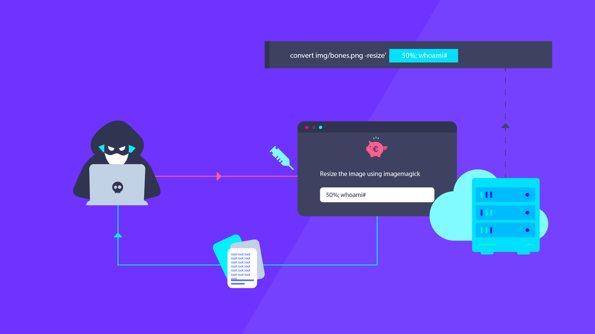

# Introduction to OS Command Injection

OS command injection is a critical security vulnerability that occurs when an attacker is able to execute arbitrary operating system commands on a target system. This is possible when the application does not properly validate or sanitize user input before it is passed to system commands.

## Security Problems in Web Applications

Web applications are increasingly becoming the target of various cyber-attacks. One such attack is the OS command injection, which poses a significant security risk. The main issues that lead to this vulnerability include:

1. **Lack of input validation and sanitization**: When user input is not thoroughly checked for malicious code or characters, it may contain commands that can be executed by the underlying operating system.
2. **Insecure coding practices**: Developers may inadvertently use functions that allow for direct execution of commands without proper validation or escape mechanisms in place.
3. **Excessive privileges**: In some cases, web applications may run with higher privileges than necessary, which can broaden the range of executable binaries accessible to an attacker and allow them to access a wider set of files.

When an attacker successfully exploits an OS command injection vulnerability, they can potentially gain unauthorized access to sensitive data, modify system files, or even take complete control of the target system. This can lead to a wide range of negative consequences, including data breaches, service disruptions, and reputational damage.

To mitigate the risks associated with OS command injection, developers must adhere to secure coding practices, implement strict input validation and sanitization, and ensure that applications run with the least privileges necessary.

## Starting the lab

Link to digital ocean --> blabla1337/owasp-skf-lab:cmd

### Objective:

Perform command injection in the lab environment

### Download the lab guide:

assets/4.1.2-CMD-lab-guide.pdf

## Knowledge Check

**Run the `id` command on the target machine, what is the ouput string?**
[ANSWER: uid=1000(app) gid=1000(app) groups=1000(app)] 

   - a) The process of inserting HTML code into a web application
   - b) **The ability to execute arbitrary operating system commands through a web application**
   - c) The act of exploiting weak random number generators in applications
   - d) The process of creating cryptographic hashes from user input

**Which coding practice can lead to OS command injection vulnerability?**
   - a) **Proper input validation and sanitization**
   - b) Insufficient access controls
   - c) Use of functions that directly execute commands without proper validation or escape mechanisms
   - d) Use of strong random number generators

**What can an attacker potentially gain from exploiting an OS command injection vulnerability?**
   - a) Access to a user's web browser history
   - b) The ability to create new user accounts on a web application
   - c) **Unauthorized access to sensitive data and control over the target system**
   - d) The ability to view encrypted data without the decryption key

**What is the main issue with insufficient access controls in the context of OS command injection?**
   - a) They allow for easier exploitation of weak random number generators
   - b) **They make it easier for an attacker to execute system commands**
   - c) They lead to the use of predictable password hashes
   - d) They result in the use of insecure cryptographic keys
