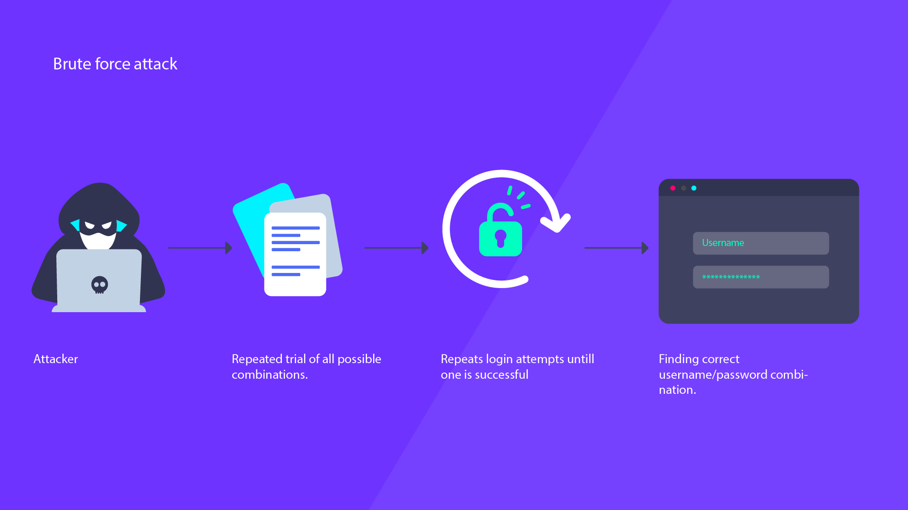
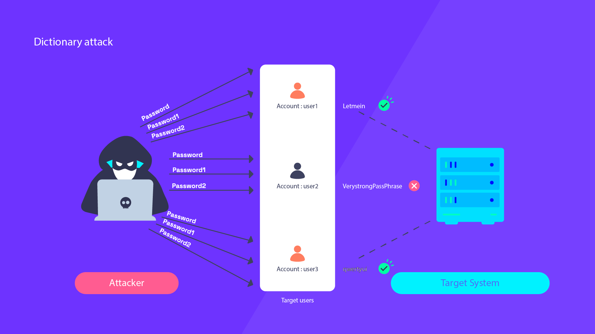

# Brute Forcing Credentials and Web Application Security

## Introduction to Brute Forcing

In the realm of cybersecurity, a brute force attack is one of the simplest, yet most effective methods used by hackers to gain unauthorized access to systems. This method involves systematically trying all possible combinations of passwords or encryption keys until the correct one is found.

The term "brute force" implies a lack of finesse or sophistication. Instead, it's about harnessing the raw power of computers, which can process millions of combinations in a short period. To imagine it in a non-digital context, think of it like trying to crack a combination lock by trying every possible combination, starting from 0000, then 0001, then 0002, and so on.

Brute force attacks can target various forms of security like passwords, PINs, and encryption keys. For instance, if a user has a four-digit PIN for their phone, a brute force attack would involve trying all 10,000 possible combinations, from 0000 to 9999. In the digital world, this process can be surprisingly quick due to the speed of modern computers.

However, the strength of brute force attacks is also their weakness. As the length and complexity of the password or encryption key increase, the number of possible combinations grows exponentially, making brute-force attacks more time-consuming and less feasible. That's why security experts always stress the importance of strong, complex passwords and encryption keys.

Moreover, many modern systems have security measures in place to defend against brute-force attacks. These measures include account lockouts after a certain number of failed attempts, delays between attempts to slow down the process, and even notifications to users about multiple failed login attempts.

Remember, understanding how brute force attacks work is the first step towards creating systems and habits that guard against them. Strong, unique passwords, multi-factor authentication, and being aware of common hacking attempts are all crucial components of a good defense strategy.

## Dictionairy attacks

In contrast to a brute force attack that attempts all possible combinations, a dictionary attack is a method of hacking that utilizes a prearranged list of likely passwords. These lists, called 'dictionaries,' are compiled with words or combinations that are commonly used in passwords.

The name 'dictionary attack' is derived from the literal use of a dictionary. Just like a regular dictionary contains a list of words, a password dictionary contains a list of common passwords. This list can range from commonly used passwords like '123456', 'password', 'admin', to more complex but frequently used combinations.

Dictionary attacks can be quite effective because, despite constant advice against it, many people still use easily guessed passwords, like their pet's name, their birthday, or common phrases. Hackers know this and they create dictionaries that include these likely password choices.

While a brute force attack will systematically guess all possible combinations, starting from 'a' and ending at 'ZZZZZ…' and beyond, a dictionary attack will first try words like 'password', 'admin', or 'letmein'. It's a more intelligent guessing game, leveraging knowledge about human behavior and common password-choosing habits.

To protect against dictionary attacks, users are advised to use complex and unique passwords that don't consist of dictionary words, predictable number sequences, or easily obtainable personal information. The use of a password manager can help create and remember these strong passwords. On the system side, measures such as account lockouts, delays between attempts, and multi-factor authentication can help guard against dictionary attacks.

In conclusion, a dictionary attack is a smarter, more targeted form of brute-force attack. It targets human predictability and the tendency to choose convenience over security, making it a potent threat against weak password practices.

## Starting the lab

Link to digital ocean --> blabla1337/owasp-skf-lab:ratelimiting

### Objective:

Brute force the application to gain access to the `devteam` account

### Download the lab guide:

assets/8.1.1-brute-force-lab-guide.pdf

## Knowledge Check

**What is the password for the `devteam` account?**
[ANSWER: letmein]

**Which of the following best describes a brute-force attack?**
   - a) Exploiting known software vulnerabilities
   - b) Intercepting and altering network data
   - c) Sending phishing emails to trick users into revealing their passwords
   - d) **Systematically trying all possible combinations of passwords until the correct one is found**

**What is the primary weakness of brute force attacks?**
   - a) They are easily detected by antivirus software
   - b) They require physical access to the target system
   - c) **They become increasingly impractical as password complexity and length increase**
   - d) They can only be performed with specialized hardware

**What type of attack involves a prearranged list of likely passwords?**
   - a) Brute force attack
   - b) **Dictionary attack**
   - c) Man-in-the-middle attack
   - d) Distributed denial-of-service (DDoS) attack

**Which of the following measures helps protect against both brute force and dictionary attacks?**
   - a) **Using complex, unique passwords**
   - b) Regularly updating antivirus software
   - c) Encrypting network data
   - d) Installing security patches promptly

**Why are dictionary attacks often more successful than brute force attacks?**
   - a) They are faster to execute
   - b) **They leverage human behavior and common password-choosing habits**
   - c) They are harder to detect
   - d) They can bypass multi-factor authentication
] 