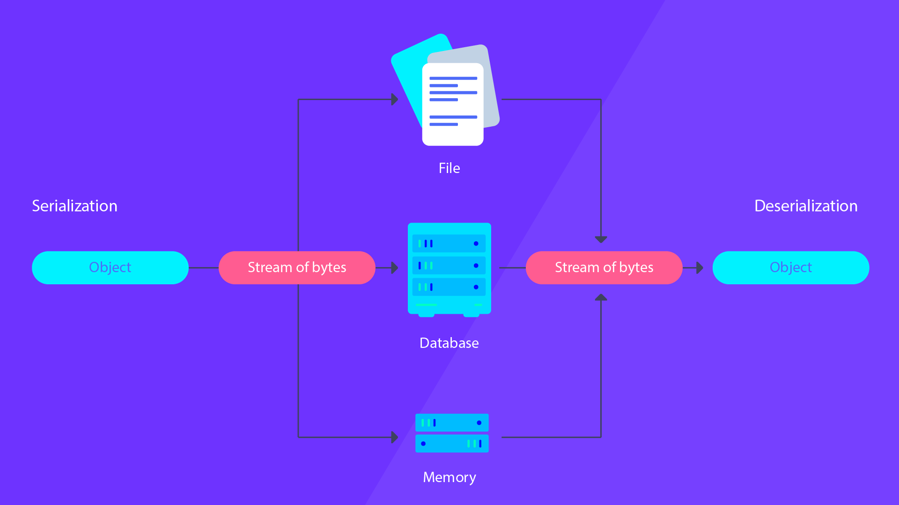

# Insecure Object Deserialization

## Introduction

Insecure Object Deserialization is a vulnerability that occurs when an application doesn't properly validate or sanitize input before attempting to "deserialize" it. Deserialization is the process of converting data structured from a format (like JSON, XML, etc.) back into an object in the memory of a program.



```java
// A simple Java object serialization/deserialization
ObjectOutputStream objectOutputStream = new ObjectOutputStream(new FileOutputStream("objectFile"));
objectOutputStream.writeObject(myObject); // This is serialization
objectOutputStream.close();

ObjectInputStream objectInputStream = new ObjectInputStream(new FileInputStream("objectFile"));
MyClass myObject = (MyClass) objectInputStream.readObject(); // This is deserialization
objectInputStream.close();
```

## How it can be a Security Problem

Applications often use object deserialization to convert data coming over the network (like from an API) into objects that the program can manipulate. However, if the incoming data isn't properly checked, it can cause a number of issues:

- **Remote Code Execution (RCE)** - If an attacker can modify the serialized data to include malicious code, and the application doesn't validate or sanitize this data before deserializing it, then the attacker's code can be executed.

- **Denial of Service (DoS)** - Malicious serialized data can also cause the application to crash, resulting in a denial of service.

- **Injection Attacks** - Insecure deserialization can lead to various injection attacks, including but not limited to SQL Injection, NoSQL Injection, OS command injection, etc.

## Starting the lab

<Link to digital ocean> --> blabla1337/owasp-skf-lab:des-pickle

### Objective:

Perform a insecure deserialization attack to gain RCE on the target server.
Download the code from the asset library to help develop the exploit.

### Download the lab guide / material:

assets/9.1.1-insecure-deserialization-lab-guide.pdf
assets/9.1.1-pickle-des.py
assets/9.1.1-solution.py

## Knowledge Check

**Use the RCE to read the requirements.txt, that is the flask version of the app?**
[ANSWER: 0.10.1] 

**What is object deserialization?**
 **- a) The process of converting a data structure or object into a format that can be stored and reconstructed later.**
   - b) The process of converting a string into an integer.
   - c) The process of encrypting data.
   - d) The process of generating a random number.

**What is a potential risk of insecure object deserialization?**
   - a) Inability to store data.
   - b) Inability to connect to the internet.
 **- c) Remote Code Execution.**
   - d) Improved application performance.

**Which Python method can be potentially dangerous due to insecure deserialization?**
 **- a) `pickle.loads()`**
   - b) `math.sqrt()`
   - c) `list.append()`
   - d) `str.split()`

**How can one mitigate the risks associated with insecure deserialization?**
   - a) By turning off the computer.
   - b) By increasing the CPU power.
   - c) By ignoring any warnings in the code.
 **- d) By validating and sanitizing incoming serialized data before deserializing it.**

**What does the `__reduce__` method in a Python class do when it comes to pickling?**
   - a) It reduces the size of the object.
 **- b) It defines what and how to pickle an object of the class.**
   - c) It reduces the computational complexity of the pickling process.
   - d) It reduces the amount of memory used by the object.

**In the context of insecure deserialization, what does a Denial of Service (DoS) attack refer to?**
   - a) An attack that forces an application to crash by providing it with malicious serialized data.
   - b) An attack that denies users access to a service by overloading the network with traffic.
   - c) An attack that reduces the service quality by consuming all available system resources.
   **- d) All of the above.**

**What is the principle of least privilege in the context of application security?**
   - a) Giving the application the highest level of privilege to ensure it can perform all tasks.
 **- b) Giving the application only the minimum privileges it needs to do its job.**
   - c) Denying all privileges to the application.
   - d) Giving the application full control over all system resources.
